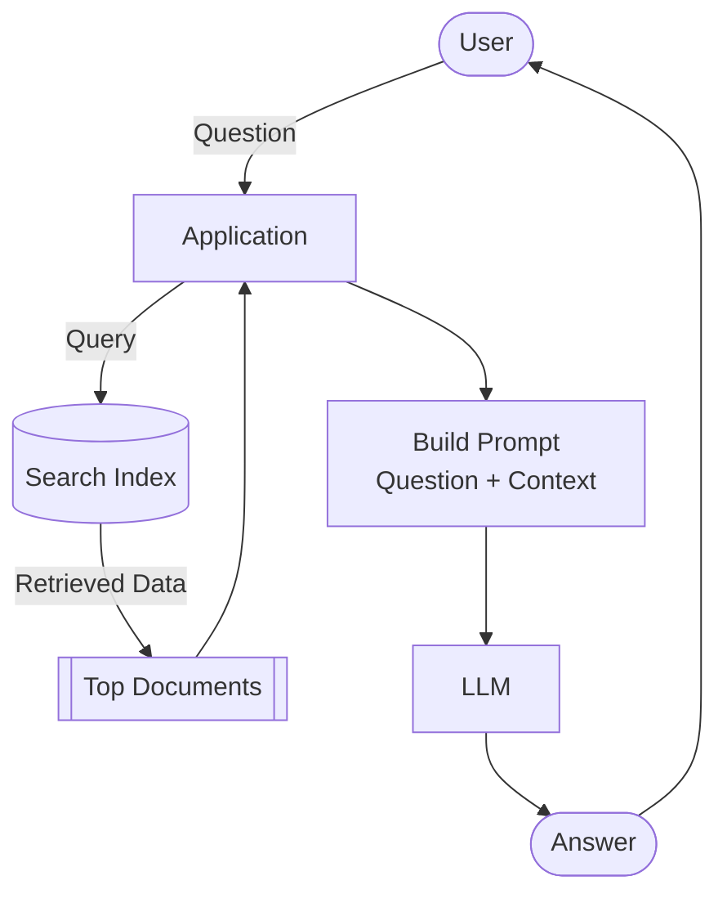
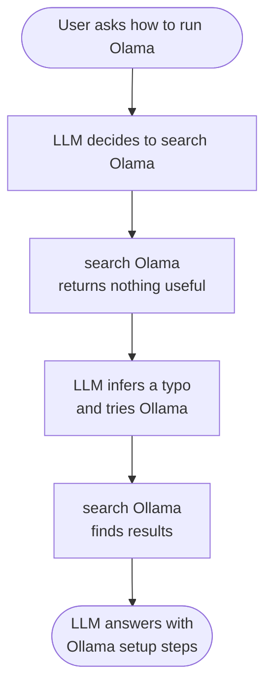

# Building RAG and Agentic RAG from Scratch

This project builds a retrieval-augmented generation (RAG) system in Python and turns it into an agent. The knowledge base is a set of course lessons in Markdown, pulled from a GitHub repository at a pinned commit. This document explains how both versions work, the ideas behind them, and the tools involved. The accompanying notebook (`course_rag.ipynb`) implements everything described here.

> **Credit:** This is a personal summary of the Agentic RAG module of [LLM Zoomcamp](https://github.com/DataTalksClub/llm-zoomcamp) (2026), a free course created and taught by [Alexey Grigorev](https://github.com/alexeygrigorev) at [DataTalks.Club](https://datatalks.club). The concepts, the example code, and the diagrams are his work. This document restates them in my own words for my own reference, and the diagrams below are adapted from his course lesson pages. Full attribution is at the [end of this document](#credits-and-attribution).

## Why RAG

A large language model is a neural network trained to predict the next piece of text. Given a prompt, it produces a plausible continuation. That works well for common knowledge, but it runs into three limits:

- It only knows what was in its training data, so anything newer is invisible to it.
- It cannot see your private documents, databases, or internal systems unless you put that information in front of it.
- It sometimes produces confident answers that are wrong (hallucinations).

RAG addresses all three by retrieving relevant documents at question time and handing them to the model alongside the question. The model reads the supplied context and generates a response grounded in it. This remains the most common way LLMs are used in production.

## How RAG works

RAG has three components: search, a prompt, and the LLM. The whole pipeline fits in a few lines:

```python
def rag(question):
    search_results = search(question)
    prompt = build_prompt(question, search_results)
    return llm(prompt)
```

Search finds the documents most relevant to the question. The prompt combines those documents with the question into a single block of text. The LLM reads that block and writes the answer.



*Diagram adapted from the LLM Zoomcamp "RAG" lesson by Alexey Grigorev (DataTalks.Club).*

The model only sees the documents you hand it, so the answer is only as good as the retrieval. Search quality is the part that matters most.

Each component is independent, which keeps the system flexible. Switch the LLM provider by changing the LLM call. Switch the search backend by changing the search call.

### Search

Every search takes a query, scores each document for similarity, and returns the top results. What separates one engine from another is how it computes that similarity score.

- Lexical (text) search counts how many words the query and the document share. It matches the surface words.
- Semantic (vector) search compares meaning rather than exact words, so it can match "can I enroll late" with "can I still join after the start date" even though they share almost no words.

This build uses lexical search through `minsearch`, a small in-memory search library. You load documents into an index, and two field types control how the engine searches them:

- Text fields get tokenized, lowercased, stripped of stop words, and ranked by relevance. The body content goes here.
- Keyword fields stay exact strings, used for filtering rather than ranking. A filename or a course identifier goes here.

Boosting weights some fields more heavily than others, so a match in a title can count for more than a match in a footnote. Filtering restricts the search to a subset, the way a SQL `WHERE` clause would, so results come only from the category you want.

### The prompt

The model cannot see the retrieved documents unless they are written into the prompt. The prompt usually splits into two parts:

- Instructions, sometimes called the system or developer message, describe the model's role and how it should answer. They stay the same on every request.
- The user prompt carries the actual question and the retrieved context, and it gets rebuilt for every request.

Building the context means turning the list of retrieved documents into one formatted string, with each document clearly separated so the model can tell them apart. The instructions tell the model to answer from the supplied context and to say it does not know when the answer is not there. That instruction is what keeps the answer grounded and cuts down on invented facts.

### The LLM

This build treats the model as a black box: text goes in, text comes out, over an API. The model is also stateless between calls. It remembers nothing on its own, so the entire conversation has to be sent on every request. The list of messages you pass in is the only memory the model has.

## Chunking

Lesson pages can run to thousands of characters. Long documents hurt retrieval in two ways. A match buried deep in a page still drags the whole page into the prompt, which wastes space and dilutes the part that actually matched. Chunking solves this: split each page into smaller, overlapping pieces and index those instead.

A sliding window does the splitting. A window of a fixed character size moves across the text in fixed steps, and each position of the window becomes one chunk. When the step is smaller than the window, neighboring chunks overlap, so a passage that straddles a boundary still appears whole inside at least one chunk.

Retrieval gets more precise, because a hit points to a small passage instead of an entire page. The prompt also gets smaller, because you send a few short chunks rather than several full pages. In this build, indexing chunks instead of whole pages cut the text sent to the model to roughly a third of its previous size for the same question.

## Ingestion and querying

The simplest setup loads the data and builds the index every time the program starts. For a small dataset that is fine, since indexing takes under a second. It breaks down as data grows: fetching and parsing millions of documents on every restart is slow, and an in-memory index disappears when the process stops.

The standard answer separates ingestion from querying. One process fetches the data and writes it to a persistent index. Another process reads from that index to answer questions. The index survives restarts, so you ingest once and query as often as you like. minsearch suits the in-memory case, while a file-based or server-based backend suits the persistent case. The pipeline around them does not change, because the search interface stays the same.

## From RAG to agentic RAG

Plain RAG always does the same thing: one search with the exact question, then an answer. That fails whenever the single search comes back empty. The user might have made a typo, phrased the question in an unusual way, or asked something that needs two separate searches to answer. A fixed pipeline has no way to recover. The search runs once, and if it returns nothing useful, the model answers from nothing useful.

Handing control to the model changes that. Instead of running search yourself and feeding the result in, you give the model a search tool and let it decide when to call it and what to look for. Now the model can correct a typo, search again with different words, or run several searches before it commits to an answer.



*Diagram adapted from the LLM Zoomcamp "Function Calling" lesson by Alexey Grigorev (DataTalks.Club).*

In RAG, the developer fixes the steps up front. In an agent, the model chooses the steps at run time.

### Function calling

The mechanism behind this is function calling. You describe your tool to the model as a JSON schema: a name, a description, and the parameters it takes. The model never sees your Python code, only this description, and the description is what it reads to decide when the tool applies.

When you send a question along with the tool, the model can respond in one of two ways. It can answer directly, or it can return a function call that names the tool and supplies arguments. Often it rewrites the question into better search keywords rather than passing it through verbatim. You run the function, then send the result back to the model in a second request, tagged with the call's identifier so the model knows which call the result answers. The model now has the question, its own decision to search, and the results, so it can write a grounded answer.

Because the model is stateless, that second request has to replay the whole history. One tool-using turn therefore costs two API calls instead of one, and the second call is larger because it carries the search results.

### The agentic loop

One tool call is not enough when the model wants to search several times, and you cannot know in advance how many calls it will want. So you wrap the exchange in a loop. The loop calls the model, runs any tool calls it returns, appends the results to the history, and calls the model again. It repeats until the model returns an answer with no further tool calls. That last condition is the exit: no tool calls this turn means the model is done.

An agent built this way has three parts:

- Instructions set its role and behavior, passed as the developer message.
- Tools are the functions it can call. Here that is a single search function.
- Memory is the running message history, which the model reads to see what it has already tried.

The model decides how many times to search, and the loop keeps going until it stops asking. In practice you add safety nets on top, such as a cap on iterations or a token budget, so a misbehaving agent cannot loop forever. The instructions are also where you steer behavior. Telling the agent to search several times with different keywords makes it explore instead of answering after the first hit. Telling it to answer only from retrieved material and to refuse off-topic questions is a lightweight scope guardrail.

### Frameworks

Writing that loop by hand is the clearest way to understand it, but you would rewrite the same boilerplate for every agent. A framework wraps it. This build uses `toyaikit`, a small teaching library whose runner is the same while-loop written out by hand. You register the search function, and the framework reads its type hint and docstring to generate the JSON schema for you, so you never write the schema yourself. Running a prompt returns the full message history, token counts, and cost in one object.

This schema-from-a-typed-function trick is not specific to toyaikit. The OpenAI Agents SDK, PydanticAI, LangChain, and others all work the same way. You write a typed function with a docstring, and the framework figures out how to describe it to the model.

## Cost and tokens

Going agentic means more round-trips, and each round-trip is a billable API call that resends the growing history. It is worth watching token usage while developing. The response object reports input and output token counts, which you multiply by the provider's per-token prices to get cost. Chunking helps here too, since smaller context means fewer input tokens on every call.

## Tools used

- **gitsource** reads files from a GitHub repository at a pinned commit and provides the sliding-window chunking helper.
- **minsearch** is the in-memory search index, with text fields for ranking and keyword fields for filtering.
- **RAGBase** is a small base class that holds the RAG pipeline (search, prompt building, and the LLM call) and is meant to be subclassed, so you can swap one piece without touching the rest.
- **OpenAI Python SDK** calls the language model (gpt-4o-mini in this build) through the Responses API.
- **toyaikit** runs the agent loop and generates tool schemas from typed Python functions.
- **Python and Jupyter** hold it together, with dataclasses used for structured return values.

## Main takeaways

- RAG is three independent parts (search, prompt, and model), and you can swap any one of them without rewriting the others.
- Retrieval quality sets the ceiling on answer quality. If the right document is not retrieved, the model cannot recover from it.
- Chunking improves retrieval precision and shrinks the prompt at the same time.
- An agent is RAG with the decision-making handed to the model. It can search more than once, fix its own mistakes, and decide when to stop.
- Function calling is the mechanism. You describe a tool as a schema, the model requests it, you run it, and you feed the result back.
- The agentic loop is a while-loop that runs tools until the model stops asking. Every agent framework is a wrapper around that idea.

## Credits and attribution

All of the underlying material here was created by **Alexey Grigorev** for **LLM Zoomcamp 2026**, a free course run by **DataTalks.Club**. That includes the RAG and agentic RAG concepts, the example code patterns (the `rag()` pipeline, `RAGBase`, the function-calling flow, and the agent loop), and the two diagrams, which are adapted from the course lesson pages.

I wrote this document as a summary for my own learning and as a record of what I worked through. I am not the author of the course or its ideas. Credit for the teaching and the original materials goes to the instructor and DataTalks.Club.

- Course: [LLM Zoomcamp](https://github.com/DataTalksClub/llm-zoomcamp) (2026)
- Instructor: [Alexey Grigorev](https://github.com/alexeygrigorev)
- Organization: [DataTalks.Club](https://datatalks.club)
- Module: [01-agentic-rag lessons](https://github.com/DataTalksClub/llm-zoomcamp/tree/main/01-agentic-rag/lessons)
- Open-source libraries from the course, also by Alexey Grigorev: [minsearch](https://github.com/alexeygrigorev/minsearch), [sqlitesearch](https://github.com/alexeygrigorev/sqlitesearch), [toyaikit](https://github.com/alexeygrigorev/toyaikit), and [gitsource](https://github.com/alexeygrigorev/gitsource).